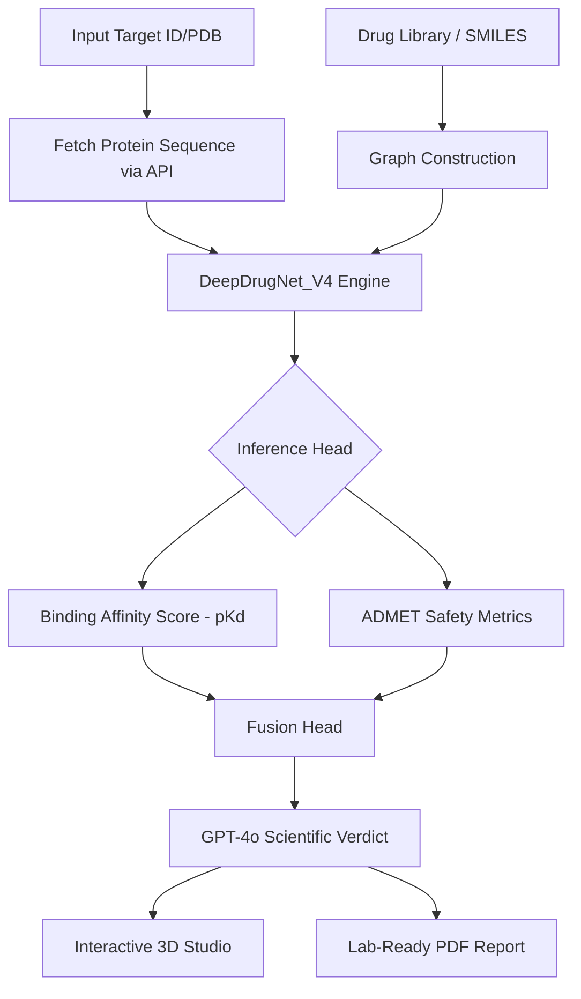

# 🧬 BioGraph Enterprise
## The Universal Drug Repurposing Engine v2.0

<p align="center">
  
</p>

**Advancing Medicine through Graph Intelligence**

BioGraph Enterprise is a state-of-the-art AI-powered scientific discovery platform designed for drug repurposing. By leveraging **Graph Neural Networks (GNNs)** and **Deep Protein Sequence Intelligence**, it accelerates the discovery of new therapeutic purposes for existing FDA-approved drugs, transforming traditional research timelines from months to minutes.

---

### 🌌 Vision & Impact
BioGraph Enterprise aims to address unmet medical needs by identifying existing therapeutic agents that can be repurposed for novel targets. This approach significantly reduces the time and cost associated with drug discovery while ensuring high safety profiles since the candidates are already clinically validated.

#### **Core Pillars:**
- **🧠 Graph Intelligence:** Atom-level reasoning using Graph Attention Networks (GAT).
- **🧬 Proteomic Analysis:** Deep sequence intelligence for target-specific binding site compatibility.
- **🤖 Clinical Reasoning:** GPT-4o-driven scientific interpretation of AI predictions.
- **🧪 Safety & ADMET:** Real-time toxicity, pharmacokinetics, and drug-likeness validation.

---

### 🔬 Scientific Workflow

The platform implements a rigorous computational pipeline ensuring high-fidelity predictions.



---

### 🧠 Technical Architecture: DeepDrugNet_V4

Our proprietary architecture fuses multiple intelligence layers:

#### **1. Drug Intelligence (Molecule-as-a-Graph)**
- **Input:** SMILES strings converted to molecular graphs.
- **Architecture:** 3-layer Graph Attention Network (GAT).
- **Features:** Captures spatial and chemical relationships between atoms.

#### **2. Protein Intelligence (Sequence Intelligence)**
- **Input:** Amino acid sequences (FASTA).
- **Architecture:** 1D Convolutional Neural Networks (CNNs).
- **Features:** Identifies local structural motifs and binding domains.

#### **3. Fusion & Reasoning**
- **Attention Fusion:** Dynamically weights the drug and protein features.
- **LLM Interpretation:** GPT-4o analyzes the numerical predictions to provide clinical context, mechanism of action, and potential side effects.

---

### 🚀 Key Platform Features

#### **1. 3D Interaction Studio & Knowledge Graph**
- **Precision Rendering:** Switch between `Cartoon`, `Stick`, and `Surface` modes.
- **3D Knowledge Graph:** Real-time visualization of the discovery space where node distance represents binding affinity.
- **Pharmacophore Mapping:** Visualize active sites (Donors, Acceptors, Hydrophobes) directly on the 3D structure.

#### **2. Intelligent Discovery Modes**
- **Manual Discovery:** Input specific SMILES or search by common drug names (via PubChem).
- **Autonomous Library Scanning:** Automatically screen the internal FDA-approved drug library against a target.
- **Batch Processing:** Upload `.csv` or `.txt` files containing thousands of molecules for high-throughput screening.

#### **3. Professional ADMET & Safety Profiling**
- **Rule of Five Compliance:** Automated Lipinski validation.
- **Physicochemical Descriptors:** Real-time calculation of LogP, TPSA, MW, and Rotatable Bonds.
- **QED Score:** Quantitative Estimate of Drug-likeness for prioritization.

#### **4. Scientific Reporting**
- **Lab-Ready PDF Reports:** Comprehensive reports including 2D structures, ADMET tables, and AI-generated clinical verdicts.
- **AI Research Assistant:** Context-aware chat system to discuss findings with 'BioGraph AI'.

---

### 🛠️ Tech Stack

| Layer | Technology |
| :--- | :--- |
| **Backend** | Python, FastAPI, PyTorch, Torch Geometric, RDKit |
| **Frontend** | React, Vite, Three.js (3D Viewer), Lucide Icons |
| **AI Models** | GNN (GAT), CNN (Protein), GPT-4o (GitHub Models) |
| **Database** | SQLite, PubChem API integration |

---

### 📂 Project Structure

```text
BioGraph_Enterprise/
├── backend/                # FastAPI Discovery Engine
│   ├── main.py             # Server Entry Point
│   ├── modules/            # Core Scientific Modules
│   │   ├── ai_model.py     # DeepDrugNet_V4 Architecture
│   │   ├── chemistry.py    # Molecular & Protein Processing
│   │   ├── llm_engine.py   # GPT-4o Integration
│   │   └── report_gen.py   # PDF Report Generation
│   └── routers/            # API Endpoints (Analysis, System)
├── frontend/               # React Dashboard (Vite)
│   ├── src/
│   │   ├── components/     # UI Components & 3D Viewer
│   │   ├── pages/          # Dashboard Layouts
│   │   └── styles/         # Global Design System
└── README.md
```

---

### 🚀 Installation & Setup

#### **1. Environment Setup**
```bash
git clone https://github.com/BioGraphAi/BioGraph_Enterprise.git
cd BioGraph_Enterprise
```

#### **2. Backend Configuration**
```bash
cd backend
python -m venv venv
source venv/bin/activate  # Windows: venv\Scripts\activate
pip install -r requirements.txt
```
Create a `.env` file in `backend/`:
```env
GITHUB_TOKEN=your_github_token_here
```

#### **3. Frontend Configuration**
```bash
cd ../frontend
npm install
```

#### **4. Launch**
```bash
# Terminal 1: Backend
python main.py

# Terminal 2: Frontend
npm run dev
```

---

### 📜 License & Acknowledgments
This project is for research and educational purposes.
Created by **BioGraph AI Team**.
*Advancing Medicine through Graph Intelligence.*
