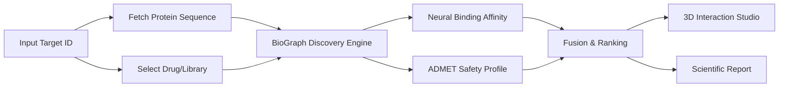
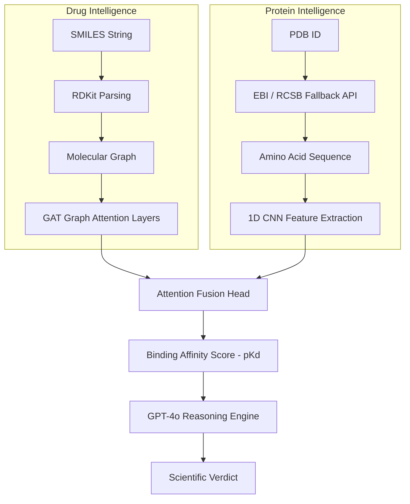

# 🧬 BioGraph Enterprise
## The Universal Drug Repurposing Engine v2.0

<p align="center">
  
</p>

**Advancing Medicine through Graph Intelligence**

BioGraph Enterprise is a next-generation AI-powered scientific discovery platform designed to discover new therapeutic purposes for existing drugs. By leveraging **Graph Neural Networks (GNNs)** and **Deep Protein Sequence Intelligence**, it transforms months of traditional research into minutes of computational inference.

---

### 🌌 Vision
BioGraph Enterprise aims to solve "unsolvable" medical cases by identifying existing FDA-approved drugs that can be repurposed for new targets. 

It integrates:
- **🧠 Graph Neural Networks:** Reasoning about molecular structures at the atomic level using GAT (Graph Attention) layers.
- **🧬 Protein Intelligence:** Analyzing target protein sequences for binding site compatibility using 1D CNNs.
- **🤖 GPT-4o Reasoning (GitHub Models):** Advanced clinical interpretation and scientific reasoning for every discovery.
- **🧪 Cheminformatics & ADMET:** Real-time safety, toxicity, and Lipinski rule-of-five validation.
- **🕹️ Interactive Discovery:** A high-performance 3D dashboard for scientists to explore protein-ligand interactions.

---

### 🔬 Scientific Workflow

The platform follows a rigorous computational pipeline to ensure high-fidelity predictions.



---

### 🧠 AI & Data Pipeline

Technical breakdown of how data flows through the **DeepDrugNet_V4** architecture.



---

### 🚀 Key Platform Features

#### **1. 3D Interaction Studio & Knowledge Graph**
- **Multi-Mode Rendering:** Toggle between `Cartoon`, `Stick`, and `Surface` views to analyze binding pockets.
- **3D Knowledge Graph Visualization:** Maps AI-predicted docking affinity scores to spatial distance. Features high-contrast color coding and 3D labels to distinguish binding strengths.
- **Pharmacophore Mapping:** Visualize active sites including Hydrophobes, Donors, and Acceptors directly on the 3D structure.

#### **2. Intelligent AI-Driven Workflows**
- **Manual Mode:** Deep-dive into a single molecule by name or SMILES (Integrated with PubChem lookup).
- **Auto Mode:** Intelligent drug discovery workflow scanning the internal FDA-approved library for new target hits.
- **Multi-Target Analysis:** Batch process thousands of molecules via `.csv` or `.txt` supporting custom SMILES lists.

#### **3. Professional ADMET Profiling**
- **Lipinski & QED:** Automated checking of the "Rule of Five" and Quantitative Estimate of Drug-likeness.
- **Real-time Descriptors:** Calculation of MW, LogP, TPSA, and Rotatable Bonds.
- **Safety Alerts:** Automated warnings for high toxicity or low bioavailability candidates.

#### **4. Scientific Reporting & Chat**
- **Advanced PDF Lab Reporting:** Generate professional, lab-ready reports with molecular images, 2D structures, and comprehensive AI diagnostics.
- **Interactive Drug Chat:** A specialized GPT-4o assistant to answer technical questions about analyzed molecules.
- **History Tracking:** Persistent local storage for all previous research sessions.

---

### 📂 Project Structure

```text
BioGraph_Enterprise/
├── backend/                # FastAPI Discovery Engine
│   ├── main.py             # Entry point
│   ├── modules/            # Core logic (AI, Chemistry, LLM)
│   │   ├── ai_model.py     # GNN implementations (DeepDrugNet_V4)
│   │   ├── llm_engine.py   # GPT-4o Integration (GitHub Models)
│   │   ├── chemistry.py    # SMILES & Protein processing (EBI/RCSB)
│   │   └── admet.py        # Safety & Toxicity logic
│   └── drugs.db            # Internal Drug Library
├── frontend/               # React Dashboard (Vite)
│   ├── src/
│   │   ├── components/     # UI Design & 3D Viewer (Studio)
│   │   ├── pages/          # Dashboard & Analytics
│   └── public/             # Static Assets
└── README.md
```

---

### 🛠️ Installation & Setup

#### **1. Clone the Repository**
```bash
git clone https://github.com/BioGraphAi/BioGraph_Enterprise.git
cd BioGraph_Enterprise
```

#### **2. Backend Setup**
```bash
cd backend
python -m venv venv
# Activate venv and install
venv\Scripts\activate  # Windows
pip install -r requirements.txt
```

#### **3. Environment Configuration**
Create a `.env` file in the `backend/` folder:
```env
GITHUB_TOKEN=your_github_personal_access_token
```

#### **4. Run Platform**
```bash
# Start Backend
python main.py

# Start Frontend (in another terminal)
cd ../frontend
npm install
npm run dev
```

---

### 👤 Credits & Authors
Created by **BioGraph AI**.
*Advancing Medicine through Graph Intelligence.*
